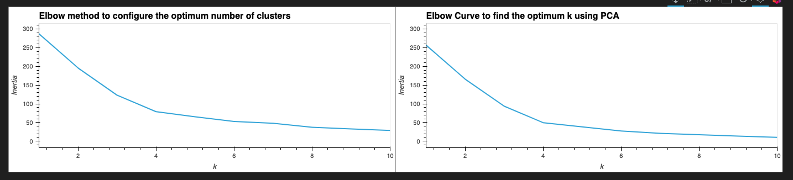
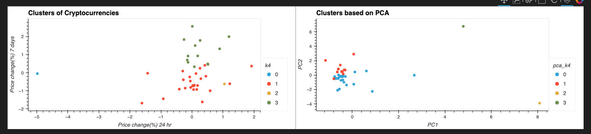

In this application we have a portfolio of crypto currencies and a range of trading data. Our goal here is to use algorithmic tools associated with unsupervized machine learning, to create clusters of data with similar features.

Centroid, a collective mean of the data points with closer variance to the mean, would be used to create clusters/groups. The variance, here, is one of the key indicators that offers us insight into the data.

All this data is analyzed using the following libraries
- Pandas
- Scikit-learn - KMeans, PCA and Standard scaler
- Hvplot

---

## Output

- The application outputs the following graphs 

#### Elbow method analysis comparison using PCA and Non-PCA methods

#### KMeans Cluster outputs using PCA and Non-PCA

---

## Technologies

The program is based on Python 3 and require the following libraries/packages to function

Jupyter Lab
JupyterLab is a web-based user interface designed for data analysis. It lets you write and run Python programs and then review the results—all in a single integrated development environment (IDE). JupyterLab works in association with the Anaconda distribution and the Conda package manager. You launch it from Terminal or Git Bash, and it then opens in a web browser window.

Pandas
Pandas is included when you use the Anaconda distribution and Conda package manager to manage your Python environments.

Scikit-learn
Scikit-learn is an open source machine learning library that supports supervised and unsupervised learning. It also provides various tools for model fitting, data preprocessing, model selection, model evaluation, and many other utilities.

---

## Installation Guide

The user of the application will have to download Python,   Python package manager PIP and Git.

   - [How to install Python](https://www.python.org/downloads/) 
   - [How to install PIP ](https://pip.pypa.io/en/stable/installation/) 
   - [How to install Git ](https://git-scm.com/book/en/v2/Getting-Started-Installing-Git) 
   

---

## Usage

To use the application, follow the steps below.

1. Download the files from Github
    > mkdir cryptoanalysis  
    > git clone https://github.com/devops4cloud/Crypto-Unsupervised-Machine-Learning  
    > cd rentanalysis
   
2. Run the notebook san_francisco_housing.ipynb

---

## Contributors

This application is Mario G.

---

## License

Copyright: N/A